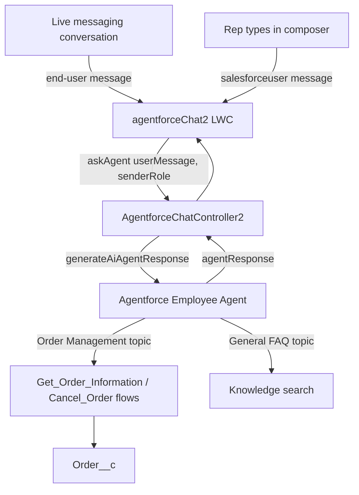

# Agent Assist Hub

A console-embedded **agent-assist experience for an Agentforce Employee Agent**. It listens to a live messaging conversation, forwards turns to the agent via `generateAiAgentResponse`, and surfaces the agent's responses — which can be suggested replies **or** the result of the agent actually invoking its actions (order lookups, cancellations, knowledge search). It distinguishes **customer** turns from **internal (rep)** turns so the agent can behave differently for each.

## Overview



The agent runs its full ReAct reasoning loop, so a turn can either draft a reply or execute an action and return the result. The `senderRole` (customer vs internal user) travels both as a context variable and an inline `[Sender: …]` tag, letting the agent — and the flows — branch on who is speaking.

## Components

| Type | Name | Purpose |
| --- | --- | --- |
| LightningComponentBundle | `agentforceChat2` | Agent Assist Hub panel. Subscribes to the live conversation, sends customer/rep turns to the agent, renders responses with copy-to-clipboard, captions ("Based on the customer conversation" vs "In response to your question"), and an optional Supervisor Chat tab. |
| ApexClass | `AgentforceChatController2` | Invokes the agent via `Invocable.Action.createCustomAction('generateAiAgentResponse', agentApiName)`. Passes `userMessage`, `sessionId`, and `senderRole`, with graceful fallback if the agent doesn't accept the `senderRole` context variable. |
| ApexClass | `AgentforceChatControllerTest2` | Unit tests for the controller. |
| GenAiPlannerBundle | `Agentforce_Employee_Agent` | The ReAct agent (Messaging surface, adaptive responses enabled). Topics: **Order Management** (Get Order Information + Cancel Order actions) and **General FAQ** (knowledge search). |
| Flow | `Get_Order_Information` | Autolaunched action. Given an order identifier (Order Number or `OrderId__c`), returns Status, Estimated Delivery Date, and times delivery was delayed. |
| Flow | `Cancel_Order` | Autolaunched action. Looks up the order, checks eligibility (status must be `Backordered`). For `enduser` it only reports eligibility; for an internal user it cancels the order (sets Status to `Cancelled`, clears delivery dates). |
| Flow | `Get_Transcript_for_Sentiment_MS` | Autolaunched action supporting messaging-session sentiment/transcript handling. |
| CustomObject | `Order__c` | Demo order object. Fields: `OrderId__c`, `Status__c`, `Estimated_Delivery_Date__c`, `Actual_Delivery_Date__c`, `times_Delivery_Delayed__c` (Name = Order Number). |

## The sender-role model

- **`enduser`** — the customer, sourced from the live conversation. Drives recommendations; the raw customer message isn't shown in the panel.
- **`salesforceuser`** — the rep typing in the composer. Treated as a direct question/command to the agent (this is where actions are typically triggered).

The `Cancel_Order` flow enforces this at the data layer: an `enduser` turn only checks cancellation eligibility and never mutates the record, while an internal-user turn performs the cancellation.

## Prerequisites

- Salesforce org with **Agentforce** (Employee Agent) enabled.
- **Messaging for In-App and Web** / enhanced messaging (the LWC subscribes to `lightning__conversationEndUserMessage`).
- API version **67.0**.

## Deployment

Deploy the components using the included manifest:

```bash
sf project deploy start -x manifest/package.xml -o <your-org-alias>
```

Or deploy the whole source tree:

```bash
sf project deploy start -d force-app -o <your-org-alias>
```

After deploy:
1. Assign Apex class access for `AgentforceChatController2` to the agent/running user.
2. Place the `agentforceChat2` component on the relevant App/Record/Home page (it exposes properties for `agentApiName`, `manualOnly`, `cardTitle`, `height`, `supervisorChatUrl`, `showDiagnostics`).
3. Confirm the `Agentforce_Employee_Agent` is connected to your messaging channel and activated.

## Testing

```bash
sf apex run test -n AgentforceChatControllerTest2 -o <your-org-alias> -r human -w 10
```

## Project structure

```
force-app/main/default/
├── classes/          AgentforceChatController2 (+ test)
├── flows/            Get_Order_Information, Cancel_Order, Get_Transcript_for_Sentiment_MS
├── genAiPlannerBundles/  Agentforce_Employee_Agent
├── lwc/              agentforceChat2
└── objects/          Order__c
manifest/
└── package.xml
```
